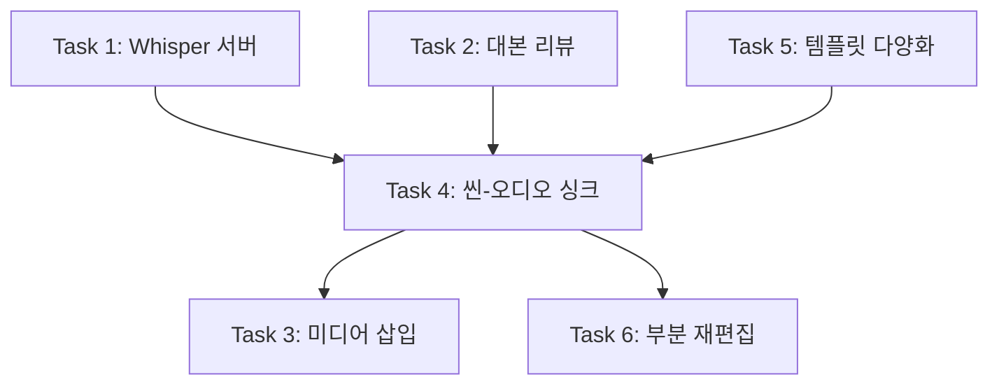

# 유튜브 자동화 파이프라인 v2 구현 계획

> **For agentic workers:** REQUIRED SUB-SKILL: Use superpowers:subagent-driven-development (recommended) or superpowers:executing-plans to implement this plan task-by-task. Steps use checkbox (`- [ ]`) syntax for tracking.

**Goal:** 37초짜리 영상을 6~14분 길이의 롱폼 유튜브 영상으로 확장하고, 대본 리뷰→TTS→Whisper 타이밍→렌더 전 과정을 사용자 개입 가능하게 재설계한다.

**Architecture:** TTS 오디오 기반으로 Whisper가 word-level 타임스탬프를 추출하고, 의미 단위로 씬을 그룹핑하여 영상 길이를 오디오에 동기화한다. 대본→승인→생성→수정의 4단계 워크플로우로 전환하며, 각 단계마다 사용자가 개입할 수 있다.

**Tech Stack:** Next.js 14 (App Router), Remotion, Qwen3-TTS (로컬 GPU), faster-whisper (Python), SSE

---

## 현재 파이프라인 (AS-IS)

```
주제입력 → 대본생성(AI) → 씬분석(AI) → GIF검색 → TTS → Remotion렌더
           (자동)        (고정 8~12씬)               (전체대본 1개)
```

**문제점:**
1. 대본을 검토/수정할 수 없음
2. 씬 수 고정(8~12개), 각 3~5초 → 총 37초
3. TTS 오디오와 씬 타이밍이 독립적
4. 자막 없음
5. 사용자 사진/영상 삽입 불가
6. 완성 후 부분 수정 불가
7. 템플릿 6종 반복 → 단조로움

## 새 파이프라인 (TO-BE)

```
주제입력 → 대본생성(AI) → [사용자 대본 리뷰/수정] → 대본 승인
    → TTS 음성 생성 → Whisper STT (word-level 타임스탬프)
    → 의미 단위 씬 그룹핑 (씬 수 = 오디오 길이 기반으로 자동 결정)
    → [사용자 미디어 삽입 지정] → GIF 검색 → AI 코드 생성
    → Remotion 렌더 (자막 포함) → [사용자 부분 수정]
```

---

## 파일 구조 (신규/수정)

| 파일 | 작업 | 역할 |
|---|---|---|
| `app/page.tsx` | **수정** | 4단계 워크플로우 UI (대본리뷰, 미디어, 렌더, 수정) |
| `app/components/ScriptReview.tsx` | **생성** | 대본 리뷰/편집 모달 |
| `app/components/MediaInsertPanel.tsx` | **생성** | 씬별 미디어 삽입 UI |
| `app/components/SceneEditor.tsx` | **생성** | 완성 후 부분 수정 UI |
| `app/api/pipeline/route.ts` | **수정** | 2단계 파이프라인 (대본생성→승인 후→나머지) |
| `app/api/whisper/route.ts` | **생성** | Groq Whisper API 호출 + 타임스탬프 반환 (로컬 서버 불필요) |
| `app/api/upload-media/route.ts` | **생성** | 사용자 미디어 업로드 처리 |
| `app/api/re-render/route.ts` | **생성** | 부분 재렌더 API |
| `app/api/whisper/route.ts` | **생성** | Groq Whisper API 호출 + 타임스탬프 반환 |
| `lib/prompts.ts` | **수정** | 롱폼 대응 프롬프트 (20~40씬) |
| `lib/scene-grouper.ts` | **생성** | Whisper 타임스탬프 → 씬 그룹핑 로직 |
| `remotion/src/templates/Subtitle.tsx` | **생성** | 자막 오버레이 컴포넌트 |
| `remotion/src/templates/SplitScreen.tsx` | **생성** | 2분할 레이아웃 |
| `remotion/src/templates/CodeBlock.tsx` | **생성** | 코드 표시 씬 |
| `remotion/src/templates/StatNumber.tsx` | **생성** | 숫자 통계 강조 씬 |
| `remotion/src/templates/ComparisonTable.tsx` | **생성** | 비교표 레이아웃 |
| `remotion/src/templates/UserMedia.tsx` | **생성** | 사용자 이미지/영상 표시 |

---

## Task 1: Groq Whisper API 연동

**Files:**
- Create: `app/api/whisper/route.ts`

### 개요
로컬 서버 없이 Groq의 무료 Whisper API를 사용하여 TTS 오디오에서 word-level 타임스탬프를 추출한다.
이미 `.env.local`에 `GROQ_API_KEY`가 저장되어 있으므로 추가 설치/설정 없음.

**Groq 무료 플랜 한도 (충분함):**
- 하루 28,800초(8시간) 분량 처리 가능
- 10분짜리 영상 기준 하루 48개 처리 가능

- [ ] **Step 1: groq npm 패키지 설치**

```powershell
npm install groq-sdk
```

Expected: `added 1 package`

- [ ] **Step 2: Whisper API 라우트 작성**

Create: `app/api/whisper/route.ts`

```typescript
import { NextRequest, NextResponse } from 'next/server';
import { readFile } from 'fs/promises';
import path from 'path';
import Groq from 'groq-sdk';

const groq = new Groq({ apiKey: process.env.GROQ_API_KEY });

export async function POST(req: NextRequest) {
  try {
    const { audioPath } = await req.json();

    // audioPath: "audio/audio-job-xxx.wav" (remotion/public/ 기준)
    const fullPath = path.join(process.cwd(), 'remotion', 'public', audioPath);
    const audioBuffer = await readFile(fullPath);

    // Groq Whisper API 호출 (word-level 타임스탬프 포함)
    const transcription = await groq.audio.transcriptions.create({
      file: new File([audioBuffer], 'audio.wav', { type: 'audio/wav' }),
      model: 'whisper-large-v3-turbo',  // 무료, 더 빠름
      language: 'ko',
      response_format: 'verbose_json',   // word-level 타임스탬프 포함
      timestamp_granularities: ['word'],
    });

    // words 배열 정규화
    const words = (transcription.words ?? []).map((w) => ({
      word: w.word.trim(),
      start: Math.round(w.start * 1000) / 1000,
      end: Math.round(w.end * 1000) / 1000,
    }));

    return NextResponse.json({
      language: transcription.language,
      duration: transcription.duration,
      words,
    });
  } catch (err) {
    console.error('[/api/whisper]', err);
    return NextResponse.json({ error: 'Whisper failed', detail: String(err) }, { status: 500 });
  }
}
```

- [ ] **Step 3: 동작 테스트**

Next.js 서버가 실행 중인 상태에서:

```powershell
# TTS로 생성된 오디오 파일이 있을 경우 테스트
$body = '{"audioPath":"audio/audio-test.wav"}' 
Invoke-RestMethod -Uri "http://localhost:3000/api/whisper" -Method POST -Body $body -ContentType "application/json"
```

Expected: `words` 배열에 각 단어와 `start`, `end` 타임스탬프 포함된 JSON 반환

- [ ] **Step 4: 커밋**

```bash
git add app/api/whisper/route.ts
git commit -m "feat: add Groq Whisper API for word-level timestamps"
```

---

## Task 2: 대본 리뷰/승인 시스템

**Files:**
- Create: `app/components/ScriptReview.tsx`
- Modify: `app/page.tsx`
- Modify: `app/api/pipeline/route.ts`

### 개요
파이프라인을 2단계로 분리한다:
1. **Phase 1**: 대본 생성 → 사용자에게 보여주고 승인/수정 대기
2. **Phase 2**: 승인 후 TTS→Whisper→씬→렌더 실행

> **사용자 질문 1 대응**: "AI가 작성한 대본을 읽어보고, 승인하거나 수정 후 다음 단계로 넘어가도록"

- [ ] **Step 1: ScriptReview 컴포넌트 작성**

Create: `app/components/ScriptReview.tsx`

```tsx
'use client';

import React, { useState } from 'react';

interface ScriptReviewProps {
  script: string;
  onApprove: (finalScript: string) => void;
  onReject: () => void;
}

export const ScriptReview: React.FC<ScriptReviewProps> = ({
  script,
  onApprove,
  onReject,
}) => {
  const [editedScript, setEditedScript] = useState(script);
  const [isEditing, setIsEditing] = useState(false);

  const charCount = editedScript.length;
  const estimatedMinutes = Math.round((charCount / 200) * 10) / 10; // 한국어 ~200자/분

  return (
    <div className="script-review">
      <div className="script-review-header">
        <h2>📝 대본 검토</h2>
        <span className="script-meta">
          {charCount}자 · 약 {estimatedMinutes}분 분량
        </span>
      </div>

      {isEditing ? (
        <textarea
          className="script-textarea"
          value={editedScript}
          onChange={(e) => setEditedScript(e.target.value)}
          rows={20}
        />
      ) : (
        <div className="script-preview">
          {editedScript.split('\n').map((line, i) => (
            <p key={i}>{line || <br />}</p>
          ))}
        </div>
      )}

      <div className="script-actions">
        <button
          className="btn btn-secondary"
          onClick={() => setIsEditing(!isEditing)}
        >
          {isEditing ? '미리보기' : '✏️ 수정하기'}
        </button>
        <button className="btn btn-danger" onClick={onReject}>
          🔄 다시 생성
        </button>
        <button
          className="btn btn-primary"
          onClick={() => onApprove(editedScript)}
        >
          ✅ 승인 · 영상 생성 시작
        </button>
      </div>
    </div>
  );
};
```

- [ ] **Step 2: page.tsx에 대본 리뷰 단계 추가**

Modify: `app/page.tsx`

```
기존 상태: topic 입력 → 전체 파이프라인 자동 실행
변경 후: topic 입력 → 대본 생성 → ScriptReview 표시 → 승인 시 나머지 파이프라인 실행
```

새로운 상태 추가:
```typescript
const [pendingScript, setPendingScript] = useState<string | null>(null);
const [approvedScript, setApprovedScript] = useState<string | null>(null);
```

Phase 1 호출 (`/api/pipeline` 대신 `/api/script` 직접 호출):
```typescript
const handleGenerateScript = async (topic: string) => {
  setIsRunning(true);
  const res = await fetch('/api/script', {
    method: 'POST',
    headers: { 'Content-Type': 'application/json' },
    body: JSON.stringify({ topic }),
  });
  const { script } = await res.json();
  setPendingScript(script);
  setIsRunning(false);
};
```

승인 후 Phase 2 호출:
```typescript
const handleApproveScript = async (finalScript: string) => {
  setPendingScript(null);
  setApprovedScript(finalScript);
  // 나머지 파이프라인 실행 (TTS, Whisper, scenes, render)
  await handleBuildVideo(finalScript);
};
```

- [ ] **Step 3: ScriptReview CSS 추가**

Append to: `app/globals.css`

```css
/* Script Review */
.script-review { /* 스타일 */ }
.script-textarea { /* 전체 폭, 어두운 배경 */ }
.script-preview { /* 줄간격, 가독성 */ }
.script-actions { /* 3개 버튼 가로 배치 */ }
```

- [ ] **Step 4: 커밋**

```bash
git add app/components/ScriptReview.tsx app/page.tsx app/globals.css
git commit -m "feat: add script review/approval step before video generation"
```

---

## Task 3: 사용자 미디어 삽입 기능

**Files:**
- Create: `app/api/upload-media/route.ts`
- Create: `app/components/MediaInsertPanel.tsx`
- Create: `remotion/src/templates/UserMedia.tsx`
- Modify: `remotion/src/types.ts` (UserMediaScene 타입 추가)
- Modify: `app/api/render/route.ts` (UserMedia 씬 렌더 지원)

### 개요
씬 목록이 생성된 후, 사용자가 두 가지 방식으로 미디어를 삽입할 수 있게 한다.

> **사용자 질문 2 대응**: "영상 중간에 원하는 부분, 타이밍에 원하는 사진이나 영상 넣기"

**케이스 A — 씬 사이에 독립 씬으로 삽입**
> "씬2 끝나고 씬3 전에 스크린샷 5초 보여주고 싶어"
- 씬 배열에 `user_media` 타입의 새 씬이 추가됨
- 총 씬 수가 늘어남
- TTS 오디오는 끊기지 않고 계속 흘러감

**케이스 B — 기존 씬의 비주얼을 교체**
> "씬3에서 AI 그래픽 대신 내 스크린샷을 배경으로 보여줘"
- 씬 타입을 `user_media`로 교체 (씬 수 변화 없음)
- 기존 씬의 텍스트/레이아웃 대신 업로드한 이미지/영상이 전체 화면으로 표시
- TTS 오디오 및 자막은 계속 흘러감 (비주얼만 바뀜)

**Remotion 오디오 구조 (두 케이스 공통)**
```
<Audio src="전체나레이션.wav" />   ← 씬과 무관하게 처음부터 끝까지 1개 오디오
<Series>
  [씬1] → [씬2] → [📷사진/영상] → [씬3] → ...  ← 비주얼만 전환
</Series>
<Subtitle words={whisperWords} />  ← 자막은 오디오 타이밍 기준으로 계속 표시
```

- [ ] **Step 1: 미디어 업로드 API 작성**

Create: `app/api/upload-media/route.ts`

```typescript
import { NextRequest, NextResponse } from 'next/server';
import { writeFile, mkdir } from 'fs/promises';
import path from 'path';

export async function POST(req: NextRequest) {
  const formData = await req.formData();
  const file = formData.get('file') as File;
  const jobId = formData.get('jobId') as string;

  if (!file || !jobId) {
    return NextResponse.json({ error: 'file and jobId required' }, { status: 400 });
  }

  const outputDir = path.join(process.cwd(), 'remotion', 'public', 'user-media');
  await mkdir(outputDir, { recursive: true });

  const ext = file.name.split('.').pop();
  const filename = `${jobId}-${Date.now()}.${ext}`;
  const buffer = Buffer.from(await file.arrayBuffer());
  await writeFile(path.join(outputDir, filename), buffer);

  return NextResponse.json({ mediaSrc: `user-media/${filename}` });
}
```

- [ ] **Step 2: UserMedia.tsx Remotion 템플릿 작성**

Create: `remotion/src/templates/UserMedia.tsx`

이미지: `` 컴포넌트로 표시, 페이드인 애니메이션
영상: `<Video>` 컴포넌트로 표시, 씬 길이만큼 재생

- [ ] **Step 3: MediaInsertPanel 컴포넌트 작성**

씬 목록을 타임라인으로 표시하고, 두 가지 방식의 미디어 삽입을 지원:

```
┌─────────┐        ┌─────────┐        ┌─────────┐
│ 씬1     │        │ 씬2     │        │ 씬3     │
│ 제목    │        │ 카드    │        │ 하이라이트│
│         │        │         │        │         │
│ [🔄교체]│        │ [🔄교체]│        │ [🔄교체]│  ← 케이스 B
└─────────┘        └─────────┘        └─────────┘
      [+ 씬 삽입]        [+ 씬 삽입]        [+ 씬 삽입]  ← 케이스 A
```

- **케이스 A [+ 씬 삽입]**: 파일 업로드 + 표시 시간(초) 지정 → 씬 배열에 `user_media` 씬 추가
- **케이스 B [🔄 교체]**: 파일 업로드 → 해당 씬의 type을 `user_media`로 교체 (기존 씬 데이터 대체)

- [ ] **Step 4: render/route.ts에 UserMedia 지원 추가**

`buildGeneratedVideoCode` 함수에 `user_media` 타입 케이스 추가.

- [ ] **Step 5: 커밋**

```bash
git add app/api/upload-media/ app/components/MediaInsertPanel.tsx remotion/src/templates/UserMedia.tsx
git commit -m "feat: add user media insertion into video timeline"
```

---

## Task 4: Whisper 기반 씬-오디오 싱크 (핵심 — 롱폼 지원)

**Files:**
- Create: `lib/scene-grouper.ts`
- Modify: `lib/prompts.ts` (20~40씬 대응)
- Modify: `app/api/pipeline/route.ts` (Whisper 연동)
- Create: `remotion/src/templates/Subtitle.tsx`
- Modify: `app/api/render/route.ts` (자막 + 동적 길이)

### 개요
가장 핵심적인 변경. 현재 고정 프레임 기반에서 오디오-싱크 기반으로 전환.

```
현재: scene.durationInFrames = 90 (고정)
변경: scene.durationInFrames = whisper가 계산한 해당 구간 프레임 수
```

- [ ] **Step 1: scene-grouper.ts 작성**

Create: `lib/scene-grouper.ts`

```typescript
interface WhisperWord {
  word: string;
  start: number;  // 초
  end: number;
}

interface SceneTimingResult {
  sceneIndex: number;
  startTime: number;
  endTime: number;
  durationInFrames: number;  // 30fps 기준
  words: WhisperWord[];      // 이 씬에 속하는 단어들 (자막용)
}

/**
 * Whisper 타임스탬프를 씬 목록에 균등 배분한다.
 * 
 * - 대본 전체에서 word들의 총 길이를 구함
 * - 씬 개수로 나누어 각 씬의 시간 범위 결정
 * - 의미 단위(문장 끝: 마침표/물음표) 기준으로 경계 보정
 */
export function assignTimings(
  words: WhisperWord[],
  sceneCount: number,
  fps: number = 30,
): SceneTimingResult[] {
  // 구현: 균등 분할 후 문장 경계로 스냅
}
```

- [ ] **Step 2: prompts.ts 롱폼 대응 수정**

Modify: `lib/prompts.ts`

```diff
# SCRIPT_PROMPT 변경
- 길이: 1,000~1,500자 (약 5~7분 분량)
+ 길이: 2,000~4,000자 (약 6~14분 분량)

# SCENES_PROMPT 변경
- 씬 총 개수: 8~12개
+ 씬 총 개수: 20~40개 (대본 길이에 비례)
- ai_free 씬: 최대 3개
+ ai_free 씬: 최대 8개
```

새로운 씬 타입 추가:
```
- split_screen: 2분할 비교 레이아웃
- code_block: 코드/명령어 표시
- stat_number: 숫자/통계 강조
- comparison_table: 비교표
```

- [ ] **Step 3: pipeline에 Whisper 연동**

Modify: `app/api/pipeline/route.ts`

기존 Step 5 (TTS) 이후에 Whisper 호출 추가:
```
Step 5: TTS → audioSrc
Step 5.5 (NEW): Whisper → words[] (타임스탬프)
Step 5.6 (NEW): scene-grouper → 각 씬에 durationInFrames 재할당
```

- [ ] **Step 4: Subtitle.tsx 자막 컴포넌트 작성**

Create: `remotion/src/templates/Subtitle.tsx`

Whisper의 word-level 타임스탬프를 기반으로, 현재 프레임에 해당하는 단어를 화면 하단에 표시.

- [ ] **Step 5: render/route.ts에 자막 레이어 추가**

GeneratedVideo에 `<Subtitle>` 컴포넌트를 최상위 레이어로 추가. 
모든 씬 위에 오버레이됨.

- [ ] **Step 6: 커밋**

```bash
git add lib/scene-grouper.ts lib/prompts.ts app/api/pipeline/route.ts remotion/src/templates/Subtitle.tsx
git commit -m "feat: Whisper-based audio-video sync with subtitles"
```

---

## Task 5: 템플릿 다양화 + CSS 수정

**Files:**
- Create: `remotion/src/templates/SplitScreen.tsx`
- Create: `remotion/src/templates/CodeBlock.tsx`
- Create: `remotion/src/templates/StatNumber.tsx`
- Create: `remotion/src/templates/ComparisonTable.tsx`
- Modify: `remotion/src/templates/GifInsert.tsx` (fallback 개선)
- Modify: 각 템플릿 CSS (줄바꿈 수정)

### 개요
기존 6종 템플릿에 4종 추가하여 총 10종. GIF 실패 시 이모지 대신 관련 SVG 일러스트 표시.

> **문제점 1 대응**: "패턴의 단조로움"
> **문제점 4 대응**: "이모지 하나만 달랑 나오고 아무것도 없다"

- [ ] **Step 1: SplitScreen.tsx 작성**

2분할 레이아웃 (왼쪽: 텍스트/이미지, 오른쪽: 텍스트/이미지)

- [ ] **Step 2: CodeBlock.tsx 작성**

코드를 깔끔하게 표시하는 씬 (모노스페이스 폰트, 라인넘버, 구문 강조 느낌)

- [ ] **Step 3: StatNumber.tsx 작성**

숫자가 카운트업 애니메이션으로 올라가는 통계 강조 씬

- [ ] **Step 4: ComparisonTable.tsx 작성**

항목들을 표로 비교 (A vs B 형식)

- [ ] **Step 5: GifInsert fallback 개선**

Modify: `remotion/src/templates/GifInsert.tsx`

GIF URL이 없을 때 🎬 이모지 → keyword 기반 SVG 아이콘 + 관련 텍스트로 변경

- [ ] **Step 6: 전체 템플릿 줄바꿈 CSS 수정**

모든 템플릿에 `word-break: keep-all; overflow-wrap: break-word;` 적용

- [ ] **Step 7: render/route.ts에 새 템플릿 import 추가**

- [ ] **Step 8: 커밋**

```bash
git add remotion/src/templates/
git commit -m "feat: add 4 new scene templates and fix CSS line-break"
```

---

## Task 6: 완성 영상 부분 재편집

**Files:**
- Create: `app/api/re-render/route.ts`
- Create: `app/components/SceneEditor.tsx`
- Modify: `app/page.tsx`

### 개요
영상 완성 후 특정 씬만 수정하여 재렌더하는 기능.

> **사용자 질문 3 대응**: "완성 영상에서 수정을 원하는 부분이 있을 경우"

- [ ] **Step 1: SceneEditor 컴포넌트 작성**

완성된 씬 목록을 타임라인으로 보여주고, 특정 씬을 클릭하면 속성을 수정할 수 있는 UI.

수정 가능 항목:
- 텍스트 내용 변경
- 씬 타입 변경 (예: card_list → highlight_text)
- 씬 순서 드래그 변경
- 씬 삭제/추가
- 미디어 교체

- [ ] **Step 2: re-render API 작성**

Create: `app/api/re-render/route.ts`

기존 jobId의 씬 데이터를 받아서 수정된 씬만 재생성 후 전체 렌더.
(ai_free 씬이 수정된 경우에만 AI 코드 재생성)

- [ ] **Step 3: page.tsx에 수정 모드 추가**

영상 완성 후 "수정하기" 버튼 → SceneEditor 표시 → 수정 완료 시 re-render 호출

- [ ] **Step 4: 커밋**

```bash
git add app/api/re-render/ app/components/SceneEditor.tsx app/page.tsx
git commit -m "feat: add post-render scene editing and re-render"
```

---

## 구현 순서 및 의존관계



**추천 실행 순서:**
1. **Task 1** (Whisper) — TTS와 함께 기반 인프라
2. **Task 2** (대본리뷰) — UI 변경, 독립적
3. **Task 5** (템플릿) — 시각 개선, 독립적
4. **Task 4** (싱크) — 핵심 통합 (1, 2, 5에 의존)
5. **Task 3** (미디어) — Task 4 이후
6. **Task 6** (재편집) — 마지막

---

## 사용자 추가 질문 답변 요약

### Q1. 대본 리뷰/수정
→ **Task 2**에서 구현. Phase 1(대본생성)과 Phase 2(영상생성)를 분리하여, 사용자가 대본을 읽고 수정하거나 재생성 요청 후 승인 버튼을 눌러야 다음 단계로 진행.

### Q2. 원하는 타이밍에 사진/영상 넣기
→ **Task 3**에서 구현. 씬 목록이 생성된 후, 타임라인 UI에서 씬 사이에 "미디어 추가" 버튼으로 삽입. 업로드된 파일은 `remotion/public/user-media/`에 저장되고, `user_media` 타입 씬으로 영상에 포함됨. **현재는 미구현** 상태.

### Q3. 완성 영상 수정
→ **Task 6**에서 구현. 영상 완성 후 "수정하기" 모드에서 씬 속성(텍스트, 타입, 순서, 미디어)을 변경하고 재렌더. 전체를 다시 생성하지 않고 수정된 부분만 재처리.
